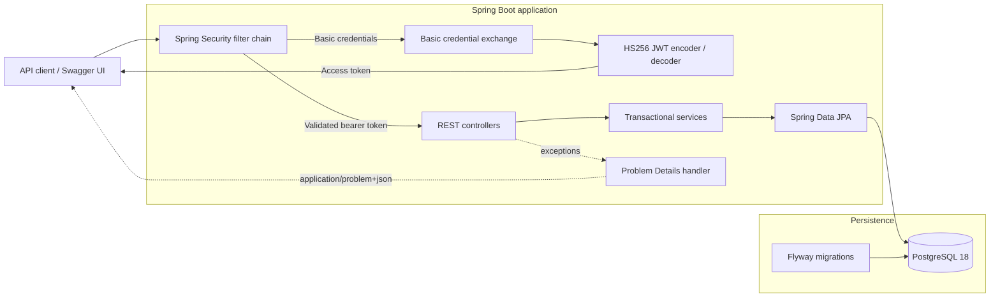
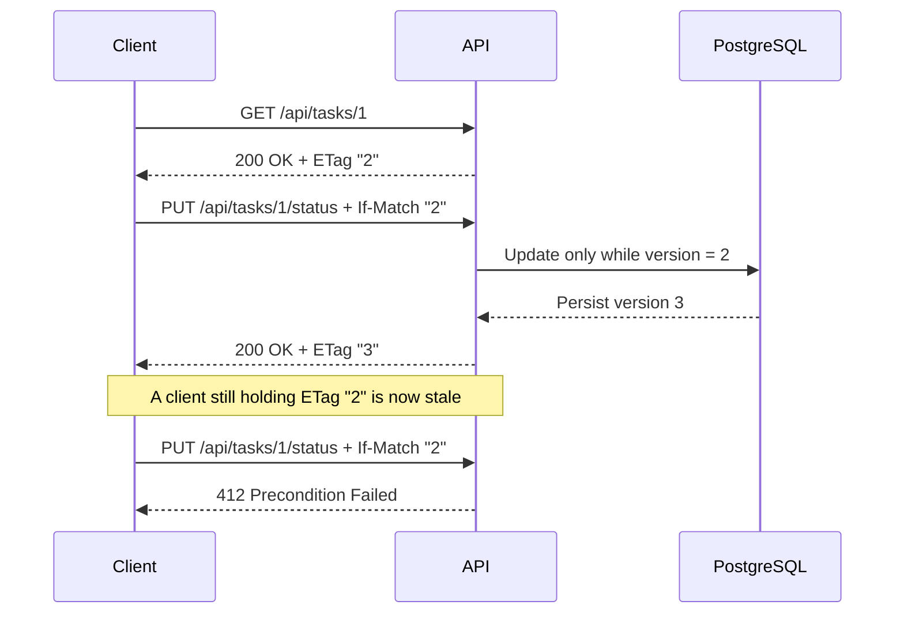
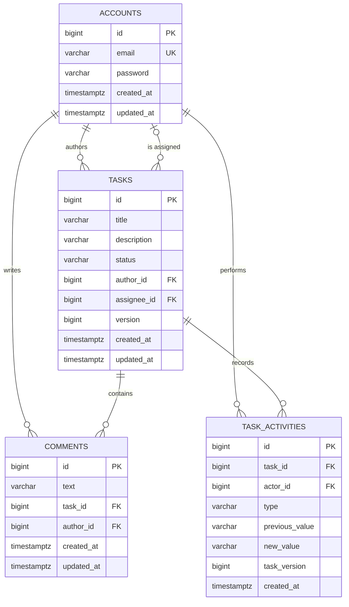
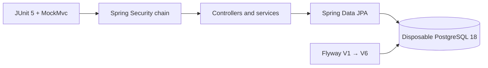

<!--suppress HtmlDeprecatedAttribute -->
<div align="center">

# Task Management System

**A Spring Boot task workflow API built around explicit authorization, safe concurrent updates, auditable change history, PostgreSQL-backed integration testing, and reproducible deployment.**

[](https://github.com/adhambatlouni/task-management-system/actions/workflows/ci.yml)
[](https://taskflow-api-tuhi.onrender.com/swagger-ui/index.html)


[Live API](#live-api) · [Architecture](#architecture) · [Quick start](#quick-start) · [API](#api-reference) · [Testing](#testing-and-ci) · [Deployment](docs/deployment.md) · [Decisions](#engineering-decisions)

</div>

---

Task Management System is a Spring Boot REST API for coordinating work between task authors and assignees. Users register, exchange credentials for a signed JWT, create and assign tasks, update status, discuss work through comments, inspect each task's activity timeline, and search the task catalog with filtering, pagination, and sorting.

The codebase stays compact while covering the concerns that make an API dependable: authorization inside the service layer, transactional writes, versioned PostgreSQL migrations, stable error contracts, externalized secrets, containerized execution, and integration tests that run through the real security and persistence stack.

## Live API

The public deployment runs the repository's Dockerized Spring Boot application on Render and stores its data in a persistent Neon PostgreSQL database.

- **Interactive API:** [Open Swagger UI](https://taskflow-api-tuhi.onrender.com/swagger-ui/index.html)
- **Machine-readable contract:** [OpenAPI JSON](https://taskflow-api-tuhi.onrender.com/v3/api-docs)
- **Service readiness:** [Health endpoint](https://taskflow-api-tuhi.onrender.com/actuator/health)

Swagger UI is the fastest way to review and exercise the complete API. The free web service may take longer to answer its first request after a period of inactivity while the instance starts.

## Engineering at a glance

| Area | Implementation |
|---|---|
| **Security** | Stateless Spring Security, BCrypt password hashing, Basic-to-JWT exchange, HS256 token validation |
| **Authorization** | Authors control assignment; authors and current assignees control task status |
| **Concurrency** | HTTP ETags and `If-Match` backed by JPA optimistic locking |
| **Traceability** | Append-only, actor-attributed activity history for task creation, assignment, and status changes |
| **Persistence** | PostgreSQL 18, JPA relationships, audit timestamps, indexed foreign keys |
| **API contract** | Curated Swagger UI, OpenAPI, Bean Validation, Problem Details, bounded pagination, controlled sorting |
| **Verification** | Full-context tests with MockMvc, Testcontainers, PostgreSQL, Flyway, and Spring Security |
| **Delivery** | Multi-stage non-root image, health-aware Docker Compose stack, Render Blueprint, GitHub Actions CI |

## Architecture



Every protected request crosses the Spring Security filter chain before it reaches a controller. Controllers handle HTTP input, services enforce permissions inside transaction boundaries, and repositories isolate persistence. Flyway establishes the schema before Hibernate validates the entity mappings against it.

## Quick start

The Docker Compose stack starts the API and PostgreSQL on a private network, waits for the database health check, applies all migrations, and then serves requests.

### Prerequisites

- Git
- Docker Desktop with Docker Compose

### 1. Clone the repository

```bash
git clone https://github.com/adhambatlouni/task-management-system.git
cd task-management-system
```

### 2. Create the local environment file

PowerShell:

```powershell
Copy-Item .env.example .env
```

macOS, Linux, or Git Bash:

```bash
cp .env.example .env
```

Set a local `DB_PASSWORD` in `.env`, then generate a Base64-encoded 32-byte JWT secret.

PowerShell:

```powershell
& { $bytes = New-Object byte[] 32; [Security.Cryptography.RandomNumberGenerator]::Create().GetBytes($bytes); [Convert]::ToBase64String($bytes) }
```

OpenSSL:

```bash
openssl rand -base64 32
```

Paste the generated value after `JWT_SECRET_BASE64=`. The `.env` file is ignored by Git and must remain local.

### 3. Build and start the stack

```bash
docker compose up --build -d
```

```bash
docker compose ps
docker compose logs -f app
```

Once the application is healthy:

- **Swagger UI:** [http://localhost:8080/swagger-ui/index.html](http://localhost:8080/swagger-ui/index.html)
- **OpenAPI JSON:** [http://localhost:8080/v3/api-docs](http://localhost:8080/v3/api-docs)
- **PostgreSQL:** `localhost:5434`, available for optional inspection through pgAdmin

### 4. Stop the stack

```bash
docker compose down
```

The named PostgreSQL volume preserves application data when containers are recreated. To deliberately remove the Docker-managed database as well:

```bash
docker compose down --volumes
```

### Cloud deployment

The repository includes a Render Blueprint for the Dockerized API and a guide for connecting it to a persistent Neon PostgreSQL database without committing credentials. See the [deployment guide](docs/deployment.md) or [open the live API](https://taskflow-api-tuhi.onrender.com/swagger-ui/index.html).

## Try the complete workflow

Swagger UI exposes both authentication schemes and every request model.

1. Execute `POST /api/accounts` twice to create an owner and an assignee.
2. Select **Authorize**, enter the owner's credentials under `basicAuth`, and execute `POST /api/auth/token`.
3. Copy the returned token, select **Authorize** again, and enter it under `bearerAuth`.
4. Create a task with `POST /api/tasks`; save its `id` and returned `ETag` value, initially `"0"`.
5. Assign the second account with `PUT /api/tasks/{taskId}/assign` and send `If-Match: "0"`; save the new `ETag`.
6. Obtain the assignee's token and use the latest `ETag` to update the task status. Comments do not change the task version.
7. Execute `GET /api/tasks/{taskId}/activities` to inspect the append-only change timeline.
8. Execute `GET /api/tasks` to see the assignment, timestamps, and aggregated comment count.

The client sends only a title and description when creating a task. The backend derives the author from the verified JWT, sets the initial status to `CREATED`, and leaves the assignee empty.

## Security and authorization

Authentication identifies the caller. The service layer then applies the permission attached to each operation.

| Action | Access rule |
|---|---|
| Register an account | Public |
| Request an access token | Valid credentials through HTTP Basic |
| Create a task | Any authenticated user; the caller becomes the author |
| Assign or unassign a task | Task author only |
| Change task status | Task author or current assignee |
| List and filter tasks | Any authenticated user |
| Add or read comments | Any authenticated user |
| Read task activity history | Any authenticated user |

Passwords are stored as BCrypt hashes. The JWT signing secret must contain at least 32 bytes, is supplied through configuration, and is never stored in the repository. Access tokens carry the authenticated email as their subject and include issued-at and expiry claims.

## API reference

| Method | Endpoint | Authentication | Purpose |
|---|---|---|---|
| `POST` | `/api/accounts` | Public | Register an account |
| `POST` | `/api/auth/token` | Basic | Exchange credentials for a JWT |
| `POST` | `/api/tasks` | Bearer | Create a task |
| `GET` | `/api/tasks/{taskId}` | Bearer | Retrieve one task with its current `ETag` |
| `GET` | `/api/tasks` | Bearer | Filter, paginate, and sort tasks |
| `PUT` | `/api/tasks/{taskId}/assign` | Bearer + `If-Match` | Assign an account, or send `none` to unassign |
| `PUT` | `/api/tasks/{taskId}/status` | Bearer + `If-Match` | Update task status |
| `POST` | `/api/tasks/{taskId}/comments` | Bearer | Add a comment |
| `GET` | `/api/tasks/{taskId}/comments` | Bearer | List comments newest first |
| `GET` | `/api/tasks/{taskId}/activities` | Bearer | List append-only task changes newest first |

Supported task statuses are `CREATED`, `IN_PROGRESS`, and `COMPLETED`. The database enforces the same set through a check constraint.

### Optimistic concurrency

Every task response includes a numeric `version`. Creation and successful task mutations also return that version as a strong HTTP `ETag`.

Clients returning to a task later retrieve it with `GET /api/tasks/{taskId}` and copy the response `ETag` into the next mutation's `If-Match` header. They do not need to remember the value from the original creation request.

```http
PUT /api/tasks/1/status
Authorization: Bearer <access-token>
If-Match: "2"
Content-Type: application/json

{
  "status": "IN_PROGRESS"
}
```

The update succeeds only while task `1` is still version `2`. A successful write increments it to version `3` and returns `ETag: "3"`. A stale `If-Match` receives `412 Precondition Failed`; omitting the header receives `428 Precondition Required`. JPA's `@Version` check also protects against another transaction committing during the update itself.



### Task activity history

Task creation, assignment changes, and status changes append activity records in the same transaction as the task mutation. Rejected stale requests and operations that leave the task unchanged do not create misleading history.

```http
GET /api/tasks/1/activities?page=0&size=20
Authorization: Bearer <access-token>
```

```json
{
  "content": [
    {
      "id": "3",
      "task_id": "1",
      "type": "STATUS_CHANGED",
      "actor": "developer@example.com",
      "previous_value": "CREATED",
      "new_value": "IN_PROGRESS",
      "task_version": 2,
      "created_at": "2026-09-21T09:05:00Z"
    }
  ],
  "page": 0,
  "size": 20,
  "total_elements": 3,
  "total_pages": 1,
  "first": true,
  "last": true
}
```

Activity types are `TASK_CREATED`, `ASSIGNEE_CHANGED`, and `STATUS_CHANGED`. `task_version` connects each event to the exact task version produced by that mutation. Results are ordered newest first and use the same page bounds as task listing.

### Filtering, pagination, and sorting

```http
GET /api/tasks?author=owner@example.com&assignee=developer@example.com&page=0&size=20&sort=created_at,desc
Authorization: Bearer <access-token>
```

| Parameter | Behavior |
|---|---|
| `author` | Optional, case-insensitive email filter |
| `assignee` | Optional, case-insensitive email filter |
| `page` | Zero-based page index; default `0` |
| `size` | Items per page from `1` to `100`; default `20` |
| `sort` | `field,direction`; default `created_at,desc` |

Allowed sort fields are `id`, `title`, `status`, `created_at`, and `updated_at`. Directions are `asc` and `desc`. Unknown fields are rejected before they reach the repository.

```json
{
  "content": [
    {
      "id": "1",
      "title": "Implement authentication",
      "description": "Verify JWT authentication for the API",
      "status": "IN_PROGRESS",
      "author": "owner@example.com",
      "assignee": "developer@example.com",
      "total_comments": 1,
      "version": 2,
      "created_at": "2026-09-21T09:00:00Z",
      "updated_at": "2026-09-21T09:05:00Z"
    }
  ],
  "page": 0,
  "size": 20,
  "total_elements": 1,
  "total_pages": 1,
  "first": true,
  "last": true
}
```

### Error contract

Domain and validation failures use `application/problem+json`. Clients receive a stable response without Java exception names or stack traces.

```json
{
  "type": "about:blank",
  "title": "Invalid request",
  "status": 400,
  "detail": "Page must be zero or greater",
  "instance": "/api/tasks"
}
```

Field-validation failures add an `errors` object keyed by field name. The API distinguishes invalid input (`400`), missing or invalid authentication (`401`), forbidden operations (`403`), missing resources (`404`), resource conflicts (`409`), stale versions (`412`), and missing update preconditions (`428`).

## Data model and migrations



Flyway owns schema evolution. Hibernate runs with `ddl-auto=validate`, so mapping drift fails at startup instead of silently changing the database.

| Migration | Change |
|---|---|
| `V1__create_initial_schema.sql` | Accounts, tasks, comments, constraints, and relationships |
| `V2__add_foreign_key_indexes.sql` | Indexes for task authors, assignees, and comment relationships |
| `V3__add_entity_timestamps.sql` | `created_at` and `updated_at` audit columns |
| `V4__add_task_version.sql` | Optimistic-lock version for concurrent task updates |
| `V5__add_task_activity_history.sql` | Append-only, indexed task activity timeline |
| `V6__backfill_task_creation_activities.sql` | Creation baselines for tasks that existed before activity tracking |

Spring Data auditing writes timestamps for normal application saves. PostgreSQL defaults keep existing rows valid when the timestamp migration is first applied.

## Testing and CI

Run the same Maven lifecycle used by GitHub Actions:

Windows:

```powershell
.\mvnw.cmd verify
```

macOS or Linux:

```bash
./mvnw verify
```

The integration suite starts a disposable `postgres:18-alpine` container and boots the complete Spring application context.



The tests cover:

- registration, duplicate-email conflicts, and request validation;
- Basic authentication and JWT issuance;
- authenticated task creation and assignment permissions;
- status authorization, version preconditions, stale-update rejection, comments, filters, and aggregate comment counts;
- actor-attributed activity history, no-op suppression, pagination, and rejected-change exclusion;
- timestamps, pagination, sorting, and invalid query parameters;
- `400`, `401`, `403`, `404`, `409`, `412`, and `428` paths without stack-trace leakage;
- stable Problem Details for malformed or unsupported request bodies;
- the current Flyway version and generated OpenAPI contract, including security schemes, examples, and concurrency headers.

GitHub Actions runs `./mvnw --batch-mode --no-transfer-progress verify` for every pull request targeting `main` and every push to `main`. The workflow uses Java 25, caches Maven dependencies, grants read-only repository access, and cancels superseded runs on the same ref.

## Engineering decisions

| Decision | Reason |
|---|---|
| **Basic auth only for token issuance** | Credentials are exchanged once; normal API requests use expiring bearer tokens |
| **Externally supplied signing key** | Secrets stay outside source control and token validation remains stable across application restarts |
| **Authorization in services** | Permissions stay next to the operations and state they protect |
| **ETag + `If-Match` + `@Version`** | Stale clients and racing transactions cannot silently overwrite newer task state |
| **Append-only activity history** | Business changes retain their actor, before/after values, task version, and timestamp |
| **Explicit transaction boundaries** | Writes remain atomic; read paths communicate intent with `readOnly = true` |
| **Open Session in View disabled** | Database access stays inside the service layer |
| **Flyway plus Hibernate validation** | Schema changes are repeatable and reviewable; entity/schema drift fails fast |
| **Bounded pages and sort allow-list** | Clients cannot request unbounded results or arbitrary persistence properties |
| **Typed aggregate projection** | Comment counts for a page are loaded with one grouped query and retain meaningful types |
| **Testcontainers** | Tests exercise PostgreSQL behavior rather than an in-memory substitute |
| **Multi-stage non-root image** | Build tools stay outside the runtime image and the application runs without root privileges |
| **Health-aware Compose startup** | The API waits for PostgreSQL readiness instead of relying on startup timing |

<details>
<summary><strong>Run Spring Boot directly</strong></summary>

### Local prerequisites

- JDK 25
- PostgreSQL 18
- Docker Desktop when running the integration tests

The default local connection is `jdbc:postgresql://localhost:5433/task_management` with user `task_app`.

PowerShell:

```powershell
$env:DB_PASSWORD = "your-local-database-password"
$env:JWT_SECRET_BASE64 = "your-base64-encoded-32-byte-secret"
.\mvnw.cmd spring-boot:run
```

macOS or Linux:

```bash
export DB_PASSWORD="your-local-database-password"
export JWT_SECRET_BASE64="your-base64-encoded-32-byte-secret"
./mvnw spring-boot:run
```

Docker Compose reads `.env`; Spring Boot does not automatically read that file when launched directly. Add the same values to the **Environment variables** field of an IntelliJ run configuration.

### Configuration reference

| Variable | Required | Default | Purpose |
|---|---:|---|---|
| `DB_URL` | No | `jdbc:postgresql://localhost:5433/task_management` | JDBC connection URL |
| `DB_USERNAME` | No | `task_app` | Application database role |
| `DB_PASSWORD` | Yes | — | Database credential |
| `JWT_SECRET_BASE64` | Yes | — | Base64 signing secret containing at least 32 bytes |
| `JWT_ACCESS_TOKEN_TTL` | No | `1h` | Access-token lifetime as a Spring `Duration` |
| `DB_BASELINE_ON_MIGRATE` | No | `false` | Opt-in Flyway baseline for adopting an existing schema |
| `DB_POOL_MAX_SIZE` | No | `5` | Maximum database connections retained by HikariCP |
| `DB_POOL_MIN_IDLE` | No | `0` | Minimum idle database connections |
| `PORT` | No | `8080` | HTTP port; cloud platforms provide this automatically |
| `OPENAPI_ENABLED` | Production only | `true` | Enables the OpenAPI contract and Swagger UI |
| `OPENAPI_SERVER_URL` | No | Render URL when available | Public base URL advertised by the generated OpenAPI contract |
| `APP_PORT` | Compose only | `8080` | Host port mapped to the API |
| `DB_PORT` | Compose only | `5434` | Host port mapped to PostgreSQL |

</details>

## Project structure

```text
src/
├── main/
│   ├── java/com/adham/taskmanagement/
│   │   ├── account/       # registration and account persistence
│   │   ├── task/          # workflow, querying, and authorization
│   │   ├── comment/       # comments and aggregate projections
│   │   ├── activity/      # append-only task change history
│   │   ├── security/      # Basic auth, JWT, and the security chain
│   │   └── common/        # auditing, errors, pagination, and OpenAPI
│   └── resources/
│       └── db/migration/  # versioned PostgreSQL schema
└── test/                  # container-backed API integration tests

.github/workflows/ci.yml   # pull-request and main-branch verification
compose.yaml               # application + PostgreSQL development stack
Dockerfile                 # multi-stage Java 25 image
render.yaml                # free Render web-service definition
docs/deployment.md         # Render + Neon deployment guide
.env.example               # local configuration template
```

---

<!--suppress HtmlDeprecatedAttribute -->
<div align="center">

Built by **[Adham Batlouni](https://github.com/adhambatlouni)**

</div>
